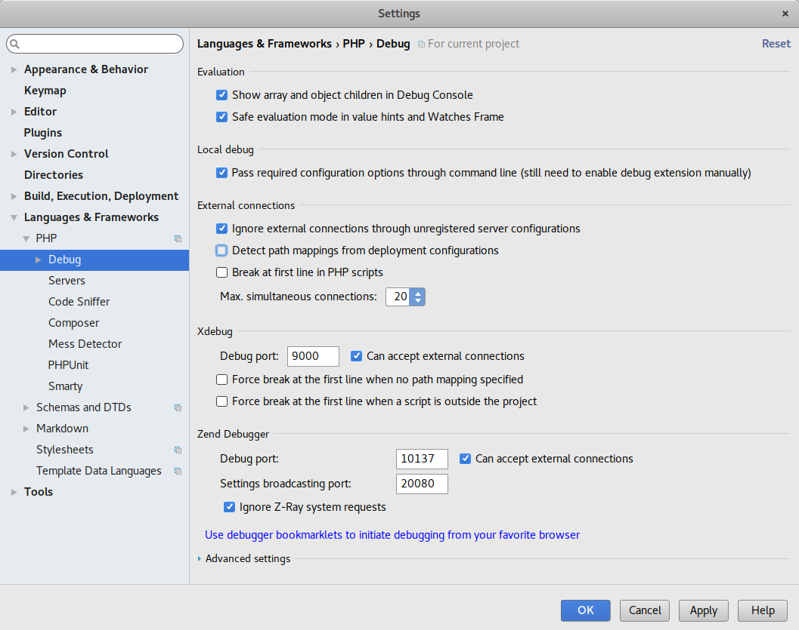
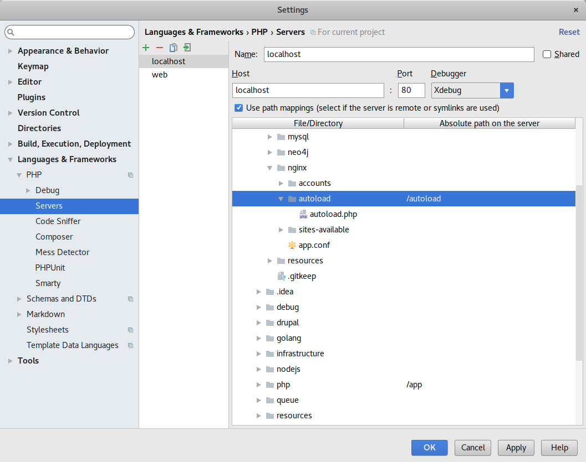
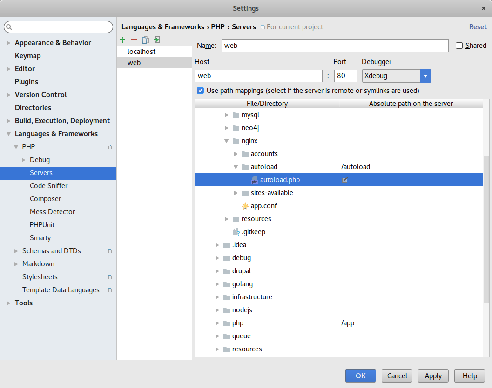
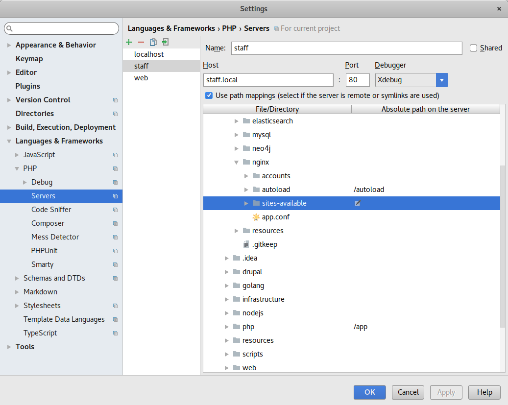
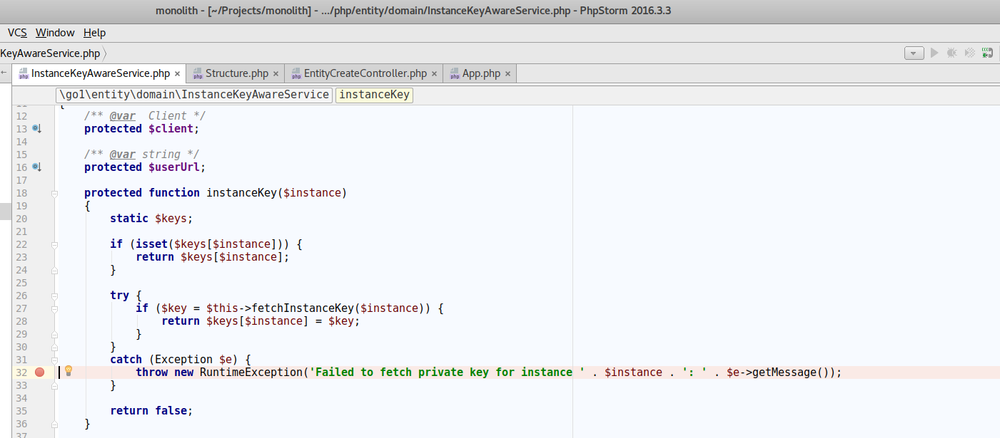

## To debug microservices, follow these steps:

1. Configure xdebug

2. Mapping host: localhost

3. Mapping host: web

4. Mapping host: staff

5. Set break points and listen for PHP debug connections

